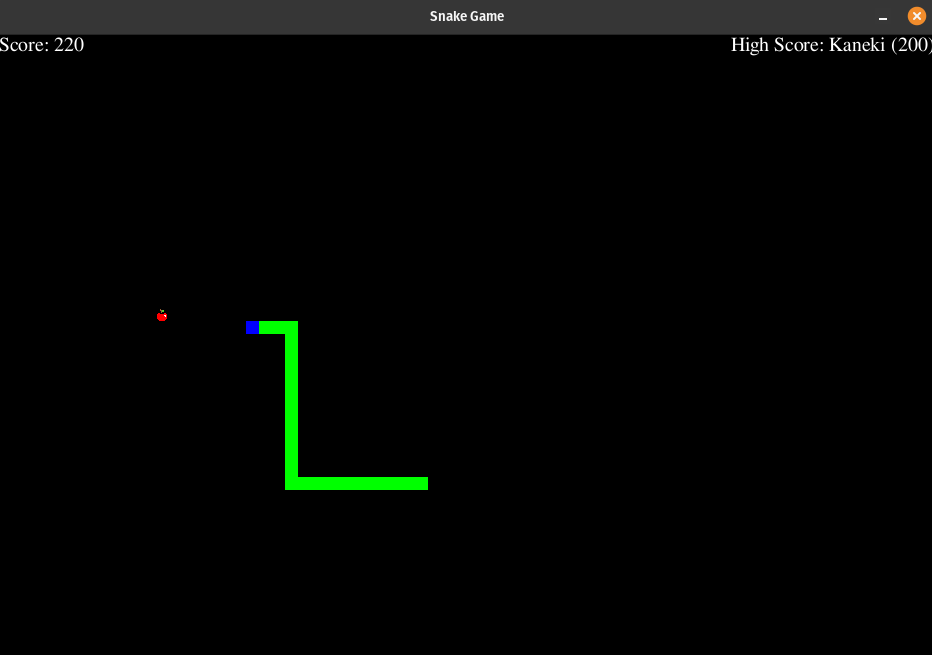

### Description/Features:
##
* Snake moves (controlled by keypad) and eats fruits (Increases score).
* Game gets more difficult by increasing speed of the snake every 120 points.
* If Snake hits border of screen or hits/eats itself player loses.
* High Score is tracked and displayed on the screen.
* Game plays music (Credit: Angry Birds Theme Song), which can be muted.

#### Available Commands:
| Command/Move                   | Description                      |
|:-------------------------------|:---------------------------------|
| Up/Down-Keypad                 | Moves Snake up/down              |
| Left/Right-Keypad              | Moves Snake Left/Right           |
| Spacebar                       | Pauses/Unpauses Game             |
| H-Keypress (When Game Paused)  | Displays These Instruction (Help)|
| M-Keypress                     | Mutes/Unmutes Music              |
  
### Technology/Tools:
##
* Tools, Technologies Used: Python3, Pygame, Random, Json, Time.

### Running Application:
##
* Running Game: python3 snake.py

### Screenshots/Video
##
* Download Game Preview: 
###

